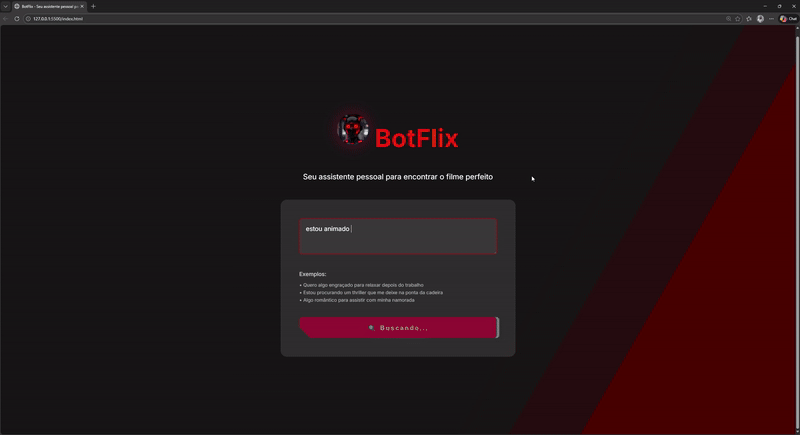

---

# 📌 🤖 README.md — BotFlix

```md
# 🎬 BotFlix - Seu Assistente Inteligente para Encontrar Filmes

BotFlix é uma aplicação web que recomenda filmes com base no seu humor ou no que você deseja assistir. Basta descrever seu sentimento ou preferência, e o sistema busca sugestões automaticamente usando integração com N8N e a API do TMDB.

---

## 🚀 Funcionalidades

- 🔍 Busca de filmes por texto (ex: "quero algo engraçado")
- 🤖 Integração com webhook do **N8N**
- 🎞️ Exibição de poster, descrição e avaliação do filme
- 🎨 Interface moderna e responsiva
- ⌨️ Suporte à tecla Enter para buscar
- 🔄 Feedback visual de carregamento

---

## 🖥️ Demonstração

> 👉 **Acesse aqui:**  
>🔗 https://botflix-ten.vercel.app/


---

## 🛠️ Tecnologias Utilizadas

- HTML5  
- CSS3 (Responsivo + Animações)  
- JavaScript (Vanilla JS)  
- N8N (Webhook backend)  
- TMDB API  
- Vercel (deploy sugerido)  

---

## 📂 Estrutura do Projeto

```

# 🤖 Botflix

Estrutura do projeto:

```text
📁 botflix
├── index.html
├── src
│   ├── css
│   │   ├── style.css
│   │   ├── reset.css
│   │   ├── responsivo.css
│   │   └── animations.css
│   ├── js
│   │   └── script.js
│   └── image
│       └── botflix-robot.jpg
└── README.md
````

---

## ⚙️ Como Rodar o Projeto

### 1️⃣ Clone o repositório

```bash
git clone https://github.com/seu-usuario/botflix.git
````

### 2️⃣ Abra o projeto

```bash
cd botflix
```

### 3️⃣ Execute no navegador

Abra o arquivo `index.html` no navegador ou use uma extensão como **Live Server** no VSCode.

---

## 🔗 Configuração do Webhook (N8N)

No arquivo `script.js`, altere o webhook para o seu:

```js
const response = await fetch("SEU_WEBHOOK_N8N_AQUI", {
  method: "POST",
  headers: { "Content-Type": "application/json" },
  body: prompt,
});
```

---

## 🎯 Exemplo de Uso

Digite algo como:

* "Quero um filme engraçado"
* "Algo romântico para assistir com minha namorada"
* "Um thriller psicológico"

E o BotFlix retorna o filme ideal pra você 🎥

---

## 📌 Melhorias Futuras

* [ ] Listar vários filmes (grid)
* [ ] Sistema de favoritos
* [ ] Login com Google
* [ ] Chat com IA (OpenAI)
* [ ] Filtro por streaming (Netflix, Prime, Disney)
* [ ] Tema dark/light automático

---

## 🤝 Contribuição

Contribuições são bem-vindas!
Sinta-se à vontade para abrir uma issue ou pull request.

---

## 📜 Licença

Este projeto está sob a licença MIT.

---

## 👨‍💻 Autor

**Willians Martins**
💼 Desenvolvedor Full Stack Python


---

⭐ Se você gostou do projeto, deixe uma estrela no repositório!

```
